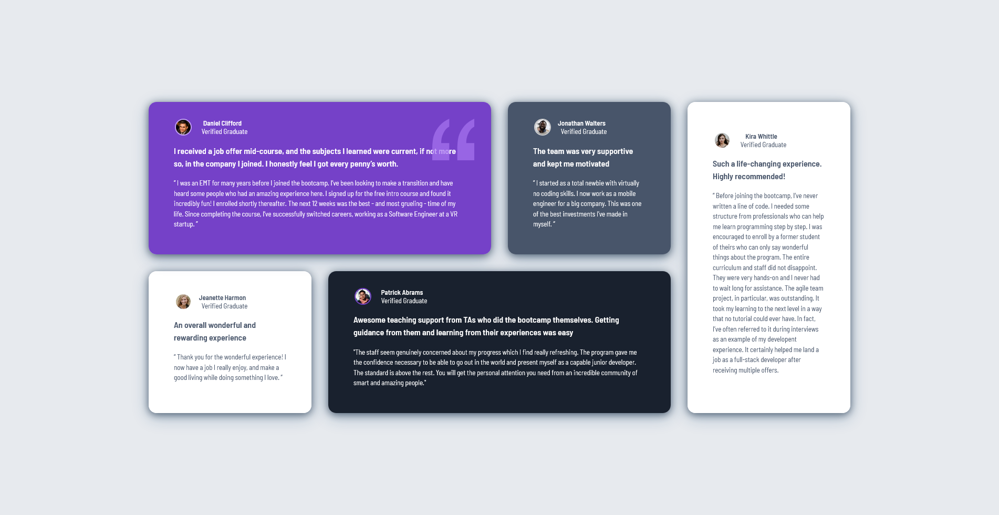

# 🧩 Testimonials Grid Section

This is my solution to the [Testimonials Grid Section challenge on Frontend Mentor](https://www.frontendmentor.io/challenges/testimonials-grid-section-Nnw6J7Un7).  
Live Demo: [https://abhishekk0929.github.io/testimonials-grid-section-main/](https://abhishekk0929.github.io/testimonials-grid-section-main/)

---

## 📸 Screenshot

<!-- Replace with your actual screenshot file path if available -->

---

## 🔗 Links

- **Live Site:** [https://abhishekk0929.github.io/testimonials-grid-section-main/](https://abhishekk0929.github.io/testimonials-grid-section-main/)
- **Frontend Mentor Challenge:** [Testimonials Grid Section](https://www.frontendmentor.io/challenges/testimonials-grid-section-Nnw6J7Un7)

---

## 🛠️ My Process

### 🧰 Built With

- Semantic HTML5 markup
- CSS custom properties
- CSS Grid
- Flexbox
- Mobile-first workflow

### 🚀 What I Learned

- Deepened my understanding of CSS Grid for complex, responsive layouts
- Practiced combining Flexbox for internal card alignment with Grid for overall page structure
- Improved my skills in writing clean, scalable CSS
- Strengthened responsive design techniques for both mobile and desktop

## 📈 Continued Development

- Further explore advanced CSS Grid layouts
- Practice more with desktop media queries and browser compatibility
- Improve accessibility and ARIA usage

## 📚 Useful Resources

- [Frontend Mentor Help Center](https://www.frontendmentor.io/help)
- [CSS Tricks: A Complete Guide to Flexbox](https://css-tricks.com/snippets/css/a-guide-to-flexbox/)
- [MDN Web Docs: CSS Grid Layout](https://developer.mozilla.org/en-US/docs/Web/CSS/CSS_Grid_Layout)

## 👤 Author

- Frontend Mentor - [@abhishekk0929](https://www.frontendmentor.io/profile/abhishekk0929)

